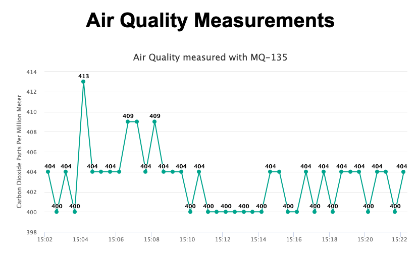

# Carbon Dioxide Parts Per Million Meter
## CO2PPM
```
Air Quality Sensor based on:
ESP-8266
MQ-135

Replace ssid and password in the code with your own:

const char* ssid = "ssid";
const char* password = "password";

The ESP hosts a site that builds a chart with de CO2 values that the sensor provides.
You can find an example at https://airquality.hodc.nl/
```
| Situation | PPM |
| ----------- | ----------- |
| Atmospheric CO2 Level | 400 |
| Average indoor co2 | 350-450 |
| Maxiumum acceptable co2| 1000|
| Dangerous co2 levels | >2000 |

## End Points

| What | URL |
| ----------- | ----------- |
| Grafh at root | http://192.168.1.100/ |
| View log at | http://192.168.1.100/log |
| To set a new low value | http://192.168.1.100/set/190 |
| Read PPM | http://192.168.1.100/AirQuality |


